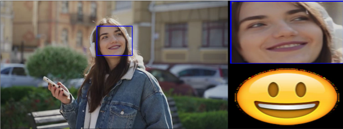

# ComputerVisionFinalProject

TJU 计算机视觉课程 大作业

## 基于深度神经网络的实时人脸检测及表情分类系统

### 项目说明

可调用摄像头读取视频，实时检测人脸并识别人脸表情

+ 使用一个二分类模型（预训练的ResNet18）检测图像中有无人脸
+ 如果有，交给人脸定位模型（预训练的ResNet34）确定人脸位置
+ 将上一模型框选到的人脸送入表情分类模型（ResNet18 或 VGG19）
+ 根据模型分类得分，显示当前表情的emoji图像

### 文件结构说明

+ Detector：人脸定位模型（预测人脸位置）
+ ExpressionClassifier：表情分类模型（识别人脸表情）
+ FaceClassifer：人脸检测二分类模型（检测有无人脸）
+ FaceToEmoji：最终系统入口

### 运行说明

+ 进入不同的模块（人脸检测模型、人脸定位模型、表情分类模型）可训练得到相应模型文件
+ 进入FaceToEmoji，运行最终系统
+ 系统最终使用 ResNet18 在 FER2013 数据集上训练得到的模型作为表情分类模型
+ 详细的运行方式可参考每个模块下的README（若有）或 run.py / train.py / test.py

### 环境配置

+ Python 3.10
+ PyTorch 1.13.1
+ CUDA 11.7
+ h5py
+ sklearn
+ matplotlib

### Demo

